# SRE Agent for Proactive Reliability

## Table of Contents

1. [Repository Context](#repository-context)
2. [Overview](#overview)
3. [Architecture](#architecture)
4. [Scheduled Task: Baseline Performance Monitoring](#scheduled-task-baseline-performance-monitoring)
5. [Azure Monitor Alerts Configuration](#azure-monitor-alerts-configuration)
6. [Implementation Details](#implementation-details)
   - [AvgResponseTime Subagent](#subagent-avgresponsetime)
   - [DeploymentHealthCheck Subagent](#subagent-deploymenthealthcheck)
   - [Alert Configuration](#alert-configuration)
7. [Azure MCP Integration](#azure-mcp-model-context-protocol-integration)
8. [Demonstration Scenarios](#demonstration-scenarios)
   - [Interactive Troubleshooting](#approach-1-interactive-chat-based-troubleshooting)
   - [Automated Incident Response](#approach-2-fully-automated-incident-response-via-pagerduty-integration)
9. [Advanced Use Cases](#advanced-use-cases-azure-mcp-integration)
10. [Databricks Integration](#databricks-integration-dbx-mcp)
11. [Summary](#summary)
12. [Support and Contributing](#support-and-contributing)

---

## Repository Context

Comprehensive SRE operations automation using Azure SRE Agent with Model Context Protocol (MCP) integration.

This repository includes:

- **Production-ready Databricks MCP server** for Azure SRE Agent
- **SRE Agent assets** (best practices, ops skills, subagent configurations)
- **Deployment guides** and validation tools
- **Example architectures** and runbooks

### Repository Structure

**[databricks-srea/](databricks-srea/)** - Production Databricks MCP for SRE Agent

- Databricks MCP server built with FastMCP
- 38+ API tools for clusters, jobs, SQL, Unity Catalog, DBFS
- Agent-ready artifacts (best practices, ops skill, subagent config)
- Quickstart deployment guide for Azure Container Apps
- Start here: [databricks-srea/README.md](databricks-srea/README.md)

### Reference

**[BLOG_POST](https://techcommunity.microsoft.com/blog/appsonazureblog/mcp-driven-azure-sre-for-databricks/4494630)** - MCP-Driven Azure SRE for Databricks

- Proactive compliance automation with best practice validation
- Reactive incident response with root cause analysis
- Real-world examples and operational impact metrics

### Quickstart

```bash
git clone https://github.com/jvargh/sre-a.git
cd sre-a/databricks-srea

# Install dependencies
pip install -r requirements.txt

# Configure environment
cp src/.env.example .env
# Edit .env with your Databricks credentials
```

```bash
cd src
python entry_http.py
# Server runs on http://localhost:8000
```

---

## Overview

This document describes an intelligent Site Reliability Engineering (SRE) agent that proactively monitors Azure App Service deployments and automatically validates post-deployment health. The solution leverages Azure Monitor, Application Insights, and AI-powered subagents to detect anomalies, trigger automated health checks, and maintain baseline performance metrics.

### Key Capabilities

- **Automated Deployment Validation**: Triggers health checks automatically after slot swap operations
- **Performance Baseline Tracking**: Continuously monitors and compares response times against historical baselines
- **Proactive Alerting**: Detects performance degradation and deployment issues before users are impacted
- **Self-Healing Integration**: Works with PagerDuty and incident management systems for automated remediation

## Architecture

The SRE Agent architecture consists of three primary components:

1. **Azure Monitor Activity Log Alerts** - Detects slot swap operations in real-time
2. **Application Insights** - Provides telemetry and performance metrics
3. **AI Subagents** - Perform intelligent health checks and baseline analysis


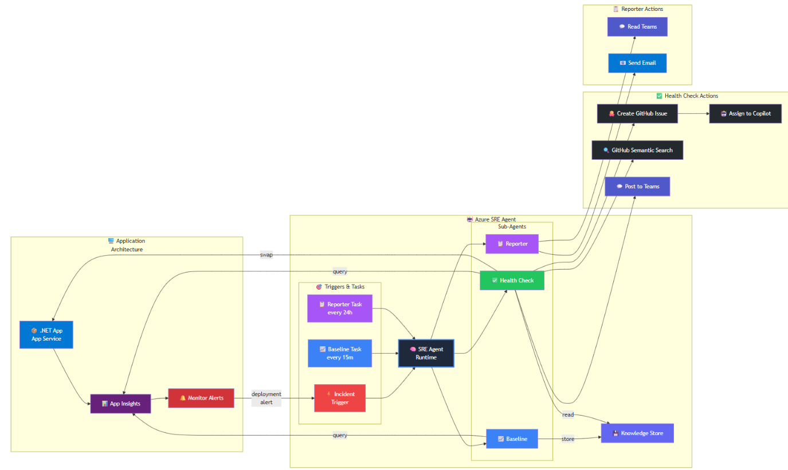

### Architecture Components

**Activity Log Alert**: Monitors Azure Resource Manager events for `Microsoft.Web/sites/slots/slotsswap/Action` operations. When a slot swap succeeds, it triggers the deployment health check workflow.

**Application Insights Integration**: Collects request telemetry, response times, and dependency metrics. The agent queries this data using KQL (Kusto Query Language) to calculate baselines and detect anomalies.

**Subagent Orchestration**: Two specialized subagents work in tandem:
- **AvgResponseTime Subagent**: Calculates and stores performance baselines
- **DeploymentHealthCheck Subagent**: Validates post-deployment health against baselines

## Scheduled Task: Baseline Performance Monitoring

A scheduled task runs periodically to establish and maintain performance baselines. This proactive approach ensures the agent always has recent data to compare against during deployment validation.

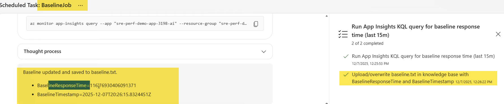

### Why Baseline Monitoring Matters

**Performance baselines** are essential for detecting anomalies. Without a baseline, it's impossible to determine if a 500ms response time is normal or indicates a problem. The scheduled task:

- Runs at regular intervals (e.g., hourly or daily)
- Queries Application Insights for average response times
- Stores historical data in `baseline.txt` for trending analysis
- Provides context for the DeploymentHealthCheck subagent to evaluate new deployments

**Best Practice**: Baseline calculations should use a rolling time window (e.g., last 24 hours) to account for normal traffic patterns and seasonal variations.

## Azure Monitor Alerts Configuration

### Activity Log Alert for Slot Swap Operations

Azure App Service **deployment slots** enable zero-downtime deployments by allowing you to stage changes in a non-production environment before swapping to production. This alert monitors slot swap operations to trigger automated validation.

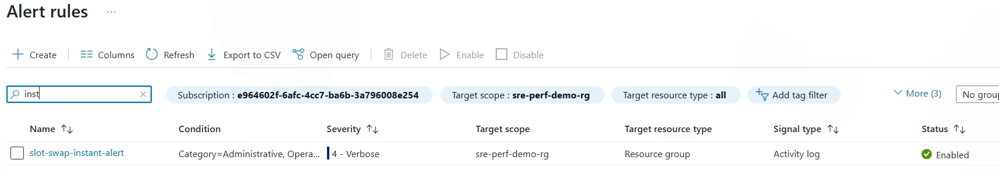

### Why Monitor Slot Swaps?

Slot swaps are a critical operation where:
- DNS traffic is instantly redirected from one slot to another
- Application settings and connection strings can change
- New code versions go live

Even with extensive pre-production testing, issues can arise in production due to:
- Configuration differences between slots
- Infrastructure-level issues (cold starts, connection pool exhaustion)
- Unexpected traffic volume or patterns

**This Sev4 alert** fires immediately after a successful swap, triggering the DeploymentHealthCheck subagent to validate the deployment within the critical first few minutes.

## Implementation Details

### Configuration with GitHub Copilot (GHCP)

The agent configuration is defined in YAML format. Use GitHub Copilot to automatically populate Azure resource details by providing the application name. Copilot will query your Azure environment and fill in:

- Subscription ID
- Resource Group name
- Application Insights workspace ID
- App Service name and resource ID

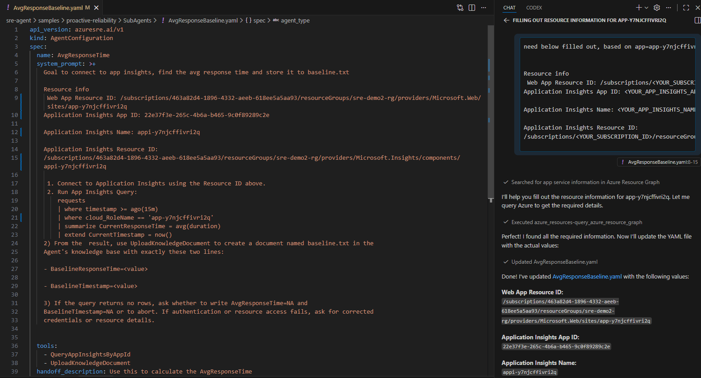

### Subagent: AvgResponseTime

**Purpose**: Calculate and track application performance baselines using Application Insights telemetry.

**How  It Works**: This subagent queries the Application Insights `requests` table using KQL to calculate the average response time (duration) over a specified time window. Results are persisted to `baseline.txt` for historical trending.

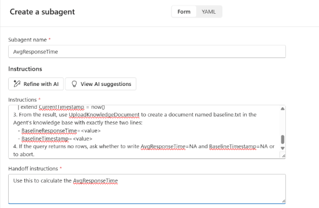

### Subagent: DeploymentHealthCheck

**Purpose**: Automatically validate application health and performance immediately after a slot swap operation.

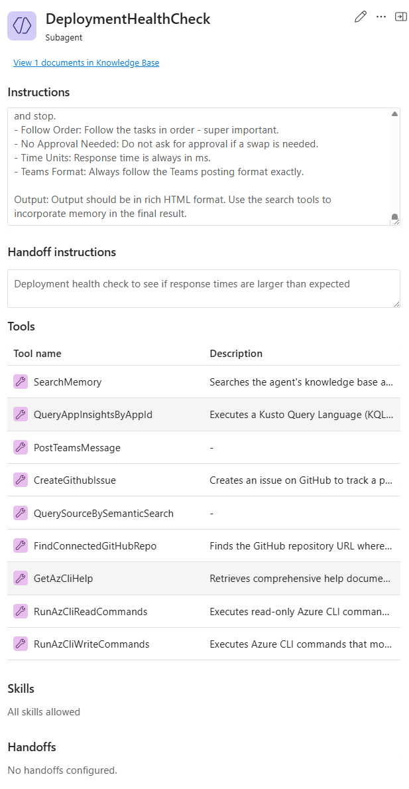

**How It Works**: When triggered by the Activity Log Alert, this subagent:

1. **Waits for warm-up period** (30-60 seconds) to allow the app to stabilize after swap
2. **Queries Application Insights** for post-deployment metrics
3. **Compares against baseline** from `baseline.txt`
4. **Analyzes error rates** and dependency failures
5. **Generates health assessment** with actionable recommendations
6. **Creates incident ticket** if anomalies are detected

### Alert Configuration

The following PowerShell script creates an Azure Monitor Activity Log Alert that triggers when a slot swap operation completes successfully. This alert is scoped to a specific resource group and monitors the Azure Resource Manager operation for slot swaps.

```powershell
$subId = "463a82d4-1896-4332-aeeb-618ee5a5aa93"
$token = az account get-access-token --query accessToken -o tsv
$alertBody = @{
    location = "global"
    properties = @{
        enabled = $true
        scopes = @("/subscriptions/$subId/resourceGroups/sre-demo2-rg")
        condition = @{
            allOf = @(
                @{ field = "category"; equals = "Administrative" },
                @{ field = "operationName"; equals = "Microsoft.Web/sites/slots/slotsswap/Action" },
                @{ field = "status"; equals = "Succeeded" },
                @{ field = "resourceGroup"; equals = "sre-demo2-rg" }
            )
        }
        actions = @{ actionGroups = @() }
        description = "Slot swap alert - succeeded only"
    }
} | ConvertTo-Json -Depth 10

$uri = "https://management.azure.com/subscriptions/$subId/resourceGroups/sre-demo2-rg/providers/microsoft.insights/activityLogAlerts/swap%20slot?api-version=2020-10-01"

Invoke-RestMethod -Uri $uri -Method Put -Headers @{ Authorization = "Bearer $token"; "Content-Type" = "application/json" } -Body $alertBody | ConvertTo-Json -Depth 5
```

### Script Breakdown

| Component | Purpose |
|-----------|--------|
| `$token = az account get-access-token` | Authenticates with Azure using Azure CLI credentials |
| `scopes = @("/subscriptions/$subId/resourceGroups/sre-demo2-rg")` | Limits alert scope to a specific resource group |
| `field = "operationName"; equals = "Microsoft.Web/sites/slots/slotsswap/Action"` | Filters for slot swap operations only |
| `field = "status"; equals = "Succeeded"` | Only triggers on successful swaps (not failed attempts) |
| `actions = @{ actionGroups = @() }` | Optional: Add action groups to send notifications to Teams, email, or webhooks |

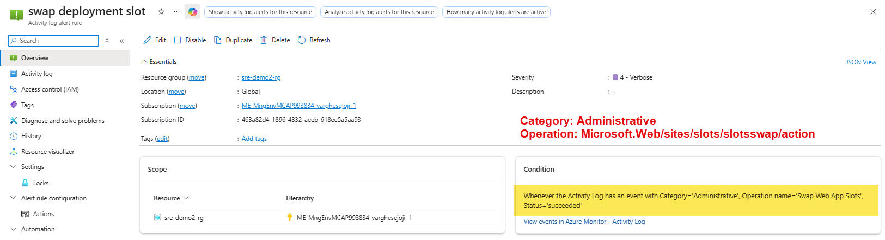

**Alert Configuration in Azure Portal**

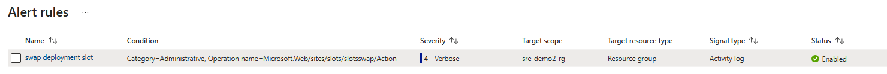

**Activity Log Entry Example** - Shows the slot swap operation captured by Azure Monitor

### Incident Trigger Logic Logic

The incident management workflow automatically routes alerts to the appropriate subagent based on severity and keywords.

**Configuration**: 
- **Severity Filter**: SEV4 (informational/monitoring)
- **Keyword Filter**: "swap" in alert title or description
- **Action**: Invoke DeploymentHealthCheck subagent

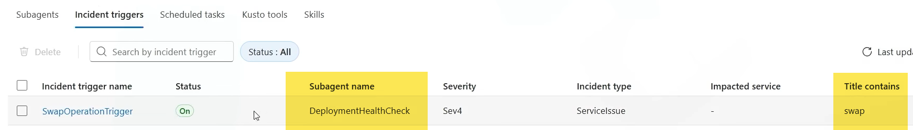

**Why SEV4**: Slot swaps are planned operations and don't warrant immediate escalation. SEV4 allows for automated validation while keeping human operators informed without creating alert fatigue.

### Scheduled Task Implementation

The scheduled task runs the AvgResponseTime subagent on a recurring schedule to maintain current performance baselines.

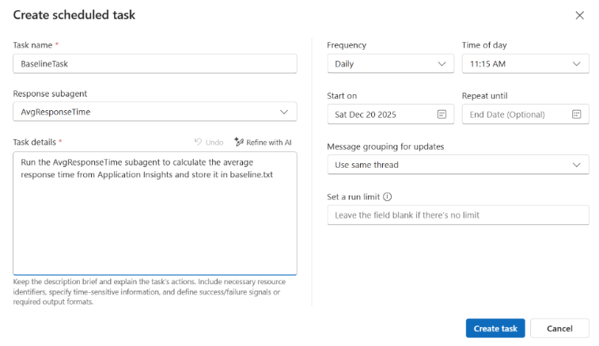

**Task Details -- AI Optimized Prompt**

The following task definition is optimized for AI agent execution. It includes clear constraints, error handling, and expected output format.

```
Run the AvgResponseTime subagent to calculate the average response time
from Application Insights and store it in baseline.txt

\-\-- LONG don't use \-\--

Goal: Calculate the average response time from Azure Application
Insights for a specified time window and persist the result to
baseline.txt.

Instructions:

\- Use existing Azure credentials and context; if unavailable, ask once
for required inputs (subscription/resource group, Application Insights
resource or workspace ID, time range) and end the turn. Do not repeat
the same question.

\- Query Application Insights (Kusto) for average server response time
(e.g., requests \| where timestamp between \<start..end\> \| summarize
avg(duration)) or the equivalent metric.

\- Output: Write a single line to baseline.txt with ISO 8601 timestamp
and numeric average in milliseconds (e.g., 2026-02-04T12:00:00Z,
123.45). If no data, write 2026-02-04T12:00:00Z, N/A and return a
concise note.

\- If baseline.txt doesn't exist, create it; otherwise append.

\- Handle edge cases: missing permissions, invalid resource, empty
result, timeouts---return a brief error and do not modify the file.

\- Constraint: Perform only the calculation and file write; do not
trigger other actions.

Self-reflect: If you need to ask the user for missing parameters, ask a
single, concise question, end the turn, and avoid repeating the same
question in subsequent turns.
```

### Task Configuration Best Practices

1. **Idempotent Operations**: Task should be safe to run multiple times without side effects
2. **Clear Output Format**: Standardized baseline.txt format enables easy parsing and trending
3. **Error Handling**: Graceful degradation when Application Insights is unavailable
4. **Credential Management**: Uses existing Azure context (DefaultAzureCredential) for authentication

---

## Azure MCP (Model Context Protocol) Integration

[Link](https://techcommunity.microsoft.com/blog/appsonazureblog/how-to-connect-azure-sre-agent-to-azure-mcp/4488905)

**Connection Type:** Select **Stdio**

*This tells the agent to communicate with the MCP server through
standard input/output*

#### Command Configuration

**Command**

```bash
npx
```

**Why npx?** `npx` is a Node.js package runner that executes packages without requiring global installation. This ensures the agent always uses the latest version of the Azure MCP server.

**Arguments**

Add each argument separately in your agent configuration:

```
-y          # Auto-confirm package installation
@azure/mcp  # Azure MCP server package
server      # Run in server mode
start       # Start the MCP server
```

#### Optional Arguments

**Subscription-Scoped Tools** (Recommended for production):

```
--namespace
subscription
```

This limits the agent's access to subscription-level operations only, preventing it from making tenant-wide changes. This follows the principle of least privilege.

**All Tools Mode** (Use with caution):

```
--mode
all
```

Exposes all available Azure MCP tools without namespace restrictions. Only use this in development environments or when broader access is explicitly required.

#### Environment Variables Configuration

To authenticate with Azure using Managed Identity (recommended for security), configure the following environment variables:

| Key | Value | Purpose |
|-----|-------|--------|
| AZURE_CLIENT_ID | `<client-id-of-your-managed-identity>` | Identifies which managed identity to use for authentication |
| AZURE_TOKEN_CREDENTIALS | `managedidentitycredential` | Forces the SDK to use Managed Identity exclusively (disables fallback to other auth methods) |

**Additional Optional Variables**:

| Key | Value | Purpose |
|-----|-------|--------|
| AZURE_TENANT_ID | `<your-tenant-id>` | Your Microsoft Entra ID (formerly Azure AD) tenant ID |
| AZURE_SUBSCRIPTION_ID | `<your-subscription-id>` | Default subscription for Azure operations |

### Why Managed Identity?

**Managed Identity** is Azure's recommended authentication mechanism because:

1. **No Secrets to Manage**: No passwords, API keys, or certificates to rotate
2. **Automatic Credential Rotation**: Azure handles credential lifecycle
3. **Principle of Least Privilege**: Grant only the necessary RBAC permissions
4. **Audit Trail**: All operations are logged with the managed identity's identity

**Security Hardening**: Setting `AZURE_TOKEN_CREDENTIALS=managedidentitycredential` disables credential fallback mechanisms (like environment variables or Azure CLI tokens), ensuring the agent can only authenticate using the configured managed identity.

#### Managed Identity Assignment

In your agent configuration UI:

1. From the **"Managed Identity"** dropdown, select the managed identity you created for the SRE Agent
2. This identity must have the following Azure RBAC permissions:
   - **Monitoring Reader** on the resource group (to read Application Insights data)
   - **Reader** on the App Service (to query resource metadata)
   - **Monitoring Contributor** (optional, if the agent needs to create/modify alerts)

**Example**: `sre1-slmop4tdlqiik`

---

# Demonstration Scenarios

## Proactive Reliability Scenarios

The SRE Agent supports both ad-hoc interactive troubleshooting and fully automated incident response workflows.

### Approach 1: Interactive Chat-Based Troubleshooting

**Use Case**: Quick investigation or exploratory analysis when you need human oversight.

**Prerequisites**:
- Agent has RBAC permissions on target Azure resources
- Agent is authenticated via Managed Identity or Azure CLI
- Application Insights is configured and collecting telemetry

**When to Use**:
- Initial investigation of a reported issue
- Ad-hoc health checks before major events
- Detailed root cause analysis requiring human judgment

#### Demo 1: Web App Unavailability Investigation

**Scenario**: Users report intermittent errors accessing the web application.

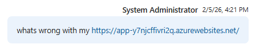
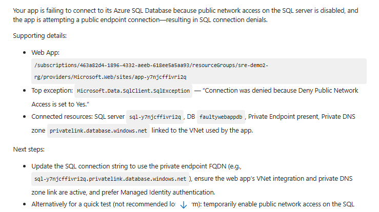

**Sample Prompts for Interactive Investigation**:

1. `What's wrong with the app?`
   - Agent queries Application Insights for recent exceptions, failed requests, and dependency failures
   - Analyzes error patterns and identifies root cause candidates

2. `Create a support case template for this issue so it's properly documented`
   - Generates structured incident report with technical details
   - Includes timeline, error messages, affected users, and reproduction steps

3. `Summarize the average response time trends for the web app app-y7njcffivri2q over the last 24 hours`
   - Queries Application Insights KQL: `requests | where timestamp > ago(24h) | summarize avg(duration) by bin(timestamp, 1h)`
   - Visualizes trends and identifies anomalies

4. `What's changed for this web app in the last 24h?`
   - Checks Azure Activity Log for deployments, configuration changes, scale operations
   - Correlates changes with performance degradation

5. `What are best practices for this web app to improve security, reliability and operational excellence?`
   - Analyzes current configuration against Azure Well-Architected Framework
   - Provides actionable recommendations (e.g., enable auto-scaling, configure health probes, implement retry policies)

#### Demo 2: Azure Kubernetes Service (AKS) Workload Troubleshooting

**Scenario**: Multiple microservices in AKS are experiencing connection timeouts and pod restarts.

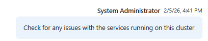
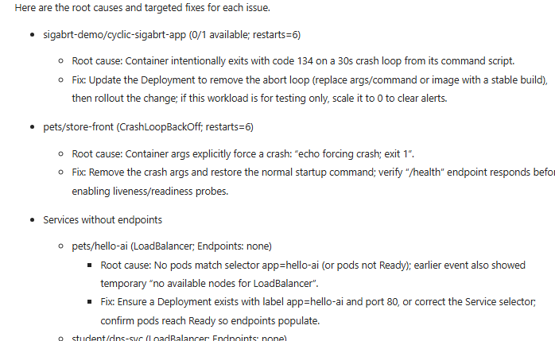

**Sample Prompts for AKS Investigation**:

1. `List the AKS clusters managed by this agent`
   - Queries Azure Resource Graph for AKS clusters in subscriptions where agent has permissions
   - Returns cluster names, versions, node counts, and health status

2. `Check for any issues with the services running on this cluster`
   - Connects to AKS cluster using managed identity credentials
   - Runs `kubectl get pods --all-namespaces` to identify failing pods
   - Analyzes resource quotas, network policies, and service endpoints

3. `Drill through logs/events and give me the specific fixes and root cause for each of these issues`
   - Retrieves pod logs: `kubectl logs <pod-name> --previous`
   - Analyzes Kubernetes events: `kubectl get events --sort-by=.metadata.creationTimestamp`
   - Correlates issues with Container Insights metrics
   - Provides specific fixes (e.g., increase memory limits, fix liveness probe, resolve DNS issues)

4. `Create individual support case templates for each issue so it's properly documented with technical specifics`
   - Generates per-issue documentation including:
     - Pod manifest  - Error logs and stack traces
     - Resource utilization metrics
     - Recommended resolution steps

### Approach 2: Fully Automated Incident Response (via PagerDuty Integration)

**Use Case**: Hands-off automated validation and remediation for known scenarios like deployments.

**How It Works**:

1. **Azure Monitor Alert fires** → Sends event to PagerDuty
2. **PagerDuty creates incident** → Tagged with severity and keywords
3. **Incident routing rule** → Triggers SRE Agent based on incident metadata
4. **Agent executes subagent** → Runs DeploymentHealthCheck automatically
5. **Results posted** → Updates incident, posts to Microsoft Teams, creates GitHub issue

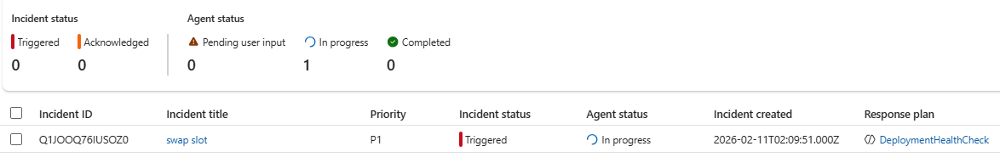

**PagerDuty Incident** - Shows SEV4 alert for slot swap operation

Click **swap slot** link to view agent execution details.

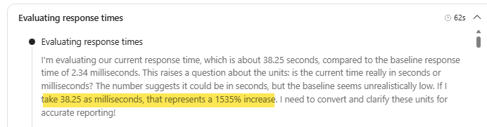

**Automated Workflow Execution** - Agent runs health checks and posts results

**Multi-Channel Notifications**: Incident updates automatically flow to:

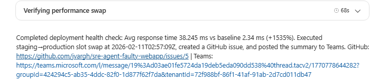

- **PagerDuty**: Incident status and resolution notes
- **Microsoft Teams**: Real-time notifications to SRE channel
- **GitHub**: Automatic issue creation for tracking and post-mortem analysis

---

# Advanced Use Cases: Azure MCP Integration

## Proactive Compliance and Governance

### Demo 4: Azure Well-Architected Framework (WAF) Compliance Assessment

**Scenario**: Automated assessment of Azure resources against organizational policies and Azure WAF best practices.

**Agent Configuration**:
- **Name**: `AZURE_WAF_COMPLIANCE_AGENT`
- **Tools**: Azure MCP server (for resource enumeration and configuration analysis)
- **Knowledge Base**: `org-practices.md` (organization-specific policies and standards)

**How It Works**:

1. Agent uses Azure MCP to enumerate all resources in resource group `sre-demo2-rg`
2. For each resource, agent queries configuration details (SKU, diagnostic settings, network rules, etc.)
3. Compares findings against:
   - **Azure WAF pillars**: Reliability, Security, Cost Optimization, Operational Excellence, Performance Efficiency
   - **Organizational policies** from `org-practices.md`
4. Generates compliance report with:
   - Pass/fail status for each policy
   - Risk assessment for non-compliant resources
   - Remediation recommendations with Azure CLI/PowerShell commands

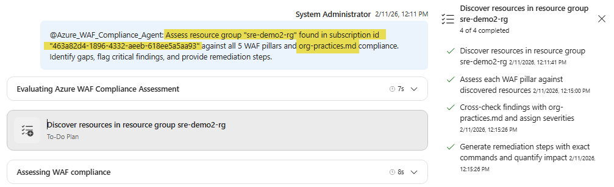

**Sample Output**: Compliance dashboard showing resource health scores and policy violations

---

# Databricks Integration: DBX MCP

## Proactive Databricks Workspace Governance

### Demo 5: Databricks Workspace Best Practices Assessment

**Scenario**: Assess Databricks workspace configuration for security, cost, and reliability best practices.

**Agent Capabilities**:

The Databricks SRE Agent combines three key components:

1. **Operations Skills** - Databricks-specific troubleshooting patterns and runbooks
2. **DBX MCP Server** - Direct API access to Databricks workspace for configuration queries
3. **Knowledge Base** - Curated best practices for Spark optimization, cluster management, and Unity Catalog

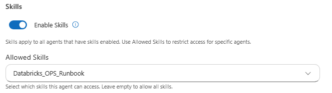

**Workspace Analysis** - Agent enumerates clusters, jobs, notebooks, and security settings

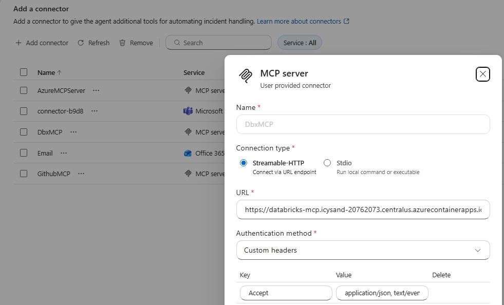

**Cluster Configuration Review** - Identifies oversized clusters, idle instances, and autoscaling opportunities

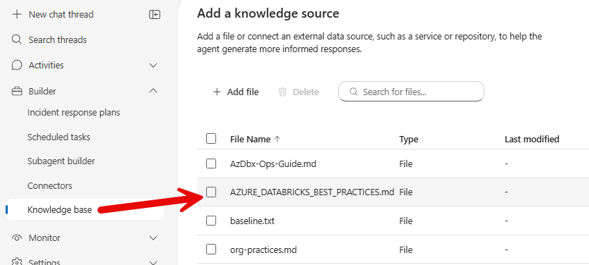

**Security Posture Assessment** - Validates Unity Catalog configuration, secret scope usage, and network  isolation

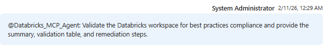

**Cost Optimization Recommendations** - Suggests cluster rightsizing and spot instance usage

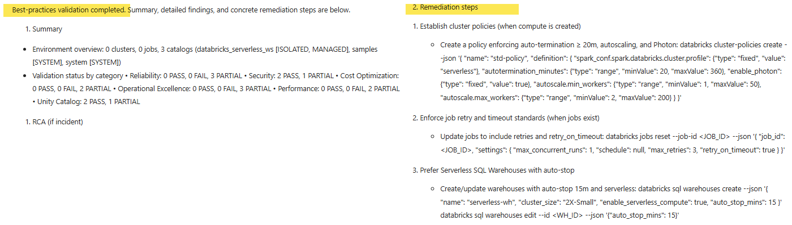

**Compliance Report** - Comprehensive assessment with prioritized action items

**Agent Evaluation**: The agent's recommendations are continuously evaluated against real-world outcomes to improve accuracy over time (see evaluation framework documentation).

## Reactive Incident Response for Databricks

When Databricks jobs fail, the agent performs automated root cause analysis by analyzing job logs, error messages, and historical run patterns.

### Demo 5A: Job Exception Analysis

**Scenario**: A critical ETL job fails with `OutOfMemoryException`.

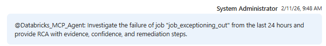
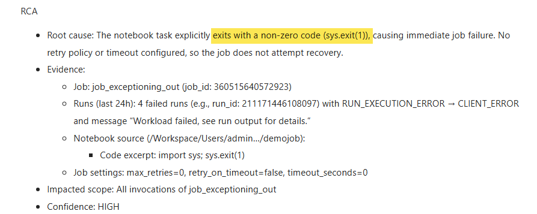
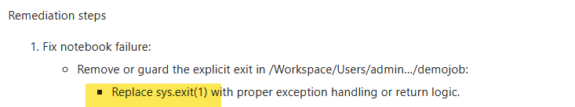

**Agent Analysis**:

1. **Log Parsing**: Extracts exception stack trace and identifies failing stage
2. **Historical Comparison**: Checks if data volume increased compared to successful runs
3. **Cluster Analysis**: Evaluates driver and executor memory allocations
4. **Recommendation**: Suggests increasing driver memory or implementing incremental processing

### Demo 5B: Job Timeout Investigation

**Scenario**: `hourly-data-sync` job consistently times out after 90 minutes.

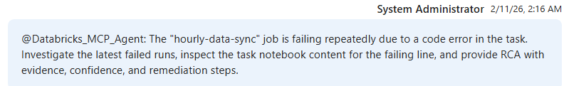

**Agent Investigation**:

- Analyzes Spark UI metrics (shuffle read/write, stage duration, GC time)
- Identifies data skew in partitions causing long-running tasks
- Checks for inefficient joins or unnecessary data scans

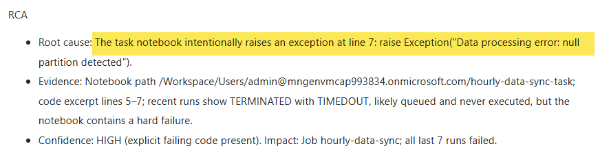

**Root Cause**: Data skew in partition key causing 90% of data to land in a single partition

**Recommended Fix**: 
```python
# Add salt to partition key to distribute data evenly
df.withColumn("partition_key", concat(col("original_key"), lit("_"), (rand() * 10).cast("int")))
```

---

## Summary

The SRE Agent for Proactive Reliability demonstrates how AI-powered automation can:

- **Reduce MTTR** (Mean Time To Resolution) by automating post-deployment validation
- **Prevent incidents** through continuous baseline monitoring and anomaly detection  
- **Improve operational efficiency** by handling routine health checks without human intervention
- **Maintain compliance** through automated governance and policy enforcement
- **Enable data-driven decisions** through comprehensive telemetry analysis and trending

**Next Steps**:
1. Configure Azure Monitor alerts for your critical operations
2. Deploy the MCP server with appropriate RBAC permissions
3. Define your performance baselines and acceptable thresholds
4. Integrate with your incident management platform (PagerDuty, ServiceNow, etc.)
5. Iterate on subagent prompts based on real-world effectiveness

---

## Support and Contributing

- **Issues**: Open a GitHub issue for bugs or feature requests
- **Discussions**: Use GitHub Discussions for questions and ideas
- **Documentation**: See [databricks-srea/README.md](databricks-srea/README.md) for detailed MCP server docs

**Built for SRE teams automating Azure operations with intelligence and speed.**

